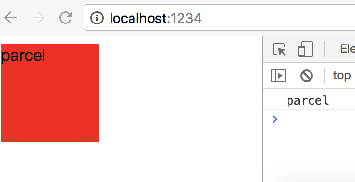
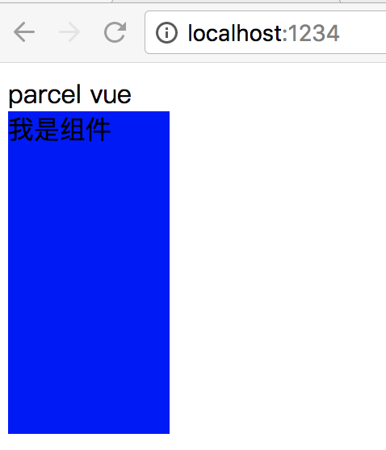
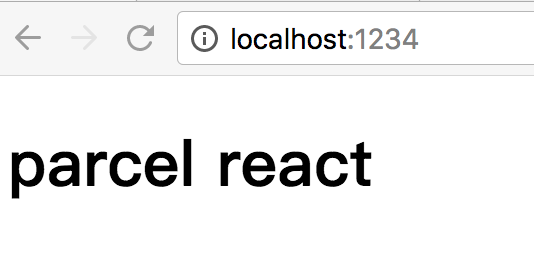

# parcel 轻量级打包工具
> 无需配置，适用于小型项目，或者各类不依赖脚手架项目


### 全局下载 `parcel` 依赖

```
npm i -g parcel-bundler
```

### 下载 `node-sass` 如果使用scss sass


```
npm i node-sass -S
```

### 打包js 默认路径在当前目录下 dist文件里创建 `index.js` `index.map` (默认支持es6)
```js
//index.js

//import './index.scss'
class Index {
    constructor(){
        document.querySelector('.app').innerHTML = 'parcel'
        console.log('parcel')
    }
}

let index = new Index()
```
```
parcel build index.js

✨  Built in 1.04s.

dist/index.js     950 B    283ms
dist/index.map      0 B    281ms
```


###  打包index.html  访问 http://localhost:1234 热更
```html
<!DOCTYPE html>
<html lang="en">
<head>
    <meta charset="UTF-8">
    <meta name="viewport" content="width=device-width, initial-scale=1.0">
    <meta http-equiv="X-UA-Compatible" content="ie=edge">
    <title>Document</title>
    <link rel="stylesheet" href="./a.css">
</head>
<body>
    <script src="./index.js"></script>
</body>
</html>
```
```scss
// index.scss
.app{
    width: 100px;
    height: 100px;
    background: red;
}
```

```
parcel index.html

Server running at http://localhost:1234 
✨  Built in 2.96s.
```

访问 http://localhost:1234 



### 生产环境下 更换输出路径为 static 下的 index 文件
```
parcel build index.html -d static/index
```

### 打包vue文件 下载插件解析 .vue 文件
```
npm i vue parcel-plugin-vue babel-preset-es2015 babel-plugin-transform-runtime -S
```

```html
<!-- vuedome.html -->

<!DOCTYPE html>
<html lang="en">
<head>
    <meta charset="UTF-8">
    <meta name="viewport" content="width=device-width, initial-scale=1.0">
    <meta http-equiv="X-UA-Compatible" content="ie=edge">
    <title>Document</title>
</head>
<body>
    <div class="app">
        <div>{{message}}</div>
        <my-component></my-component>
    </div>
    <script src="./vuedemo.js"></script>
</body>
</html>
```
```js
// vuedemo.js
import Vue from 'vue/dist/vue.js'
import Component from './Component.vue'
new Vue({
    el:'.app',
    data:{
        message:'parcel vue'
    },
    components:{
        'my-component': Component
    }
})
```
```
// Component.vue
<template>
  <div class="component">我是{{name}}</div>
</template>
<script>
export default {
    data(){
        return {
            name:'组件'
        }
    }
}
</script>
<style lang="scss" scoped>
.component{
    width: 100px;
    height: 200px;
    background: blue;
}
</style>

```

```
parcel vuedemo.html

Server running at http://localhost:1234 
✨  Built in 37ms.
```



### 打包react项目 
```
npm i react react-dom babel-preset-env babel-preset-react -S
```

创建.babelrc配置文件
```
{
    "presets":["env", "react"]
}
```

```html
<!-- reactdemo.html -->

<!DOCTYPE html>
<html lang="en">
<head>
    <meta charset="UTF-8">
    <meta name="viewport" content="width=device-width, initial-scale=1.0">
    <meta http-equiv="X-UA-Compatible" content="ie=edge">
    <title>Document</title>
</head>
<body>
    <div id="app"></div>
    <script src="./reactdemo.js"></script>
</body>
</html>
```
```js
//reactdemo.js

import React from 'react'
import ReactDom from 'react-dom'
const App = () => (
    <h1>parcel react</h1>
)

const app = document.getElementById('app')
ReactDom.render(<App />,app)
```

```
parcel reactdemo.html

Server running at http://localhost:1234 
✨  Built in 8.05s.
```


### github

[https://github.com/parcel-bundler/parcel](https://github.com/parcel-bundler/parcel)