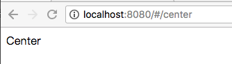
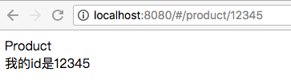
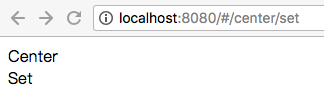

# vue-router的基础用法

> 公司内部vue-router进阶分享

## 路由的配置

创建一个个人中心页面 Center.vue

```html
<template>
  <div>Center</div>
</template>
```

在 `scr/router/index.js` 中配置个人中心页面路由

```js
import Vue from 'vue';
import Router from 'vue-router';
import Center from '@/components/Center';

Vue.use(Router);

export default new Router({
  routes: [
    {
      path: '/center', //路由的路径 路径可以自定义，如 /a/b/c 一般以业务去划分
      name: 'center', //路由的名字
      component: Center,
    },
  ],
});
```

访问 `http://localhost:8080/#/center` 即可得到



## 动态路由

创建一个商品页面 Product.vue

```html
<template>
  <div>
    Product
    <br>
    我的id是{{$route.params.id}}
  </div>
</template>
```

配置路由

```js
import Vue from 'vue';
import Router from 'vue-router';
import Product from '@/components/Product';

Vue.use(Router);

export default new Router({
  routes: [
    {
      path: '/product/:id', // 动态路径参数 以冒号开头
      name: 'product',
      component: Product,
    },
  ],
});
```

现在 `/product/123` 和 `/product/abc` 都将映射到相同的路由

```js
export default {
  mounted() {
    console.log(this.$route.params.id);  // 通过this.$route.params 可以获取 路由的params
  },
};
```

访问 `http://localhost:8080/#/product/12345`



## 子路由

创建一个个人中心下设置页面  Set.vue

```html
<template>
  <div>Set</div>
</template>
```

配置center的子路由

```js
import Vue from 'vue';
import Router from 'vue-router';
import Center from '@/components/Center';
import Set from '@/components/Set';

Vue.use(Router);

export default new Router({
  routes: [
    {
      path: '/center',
      name: 'center',
      component: Center,
      children: [
        {
          path: 'set',  //可以是绝对路径或者相对路径
          name: 'set',
          component: Set,
        },
      ],
    },
  ],
});

```

在center中设置子路由的视图组件，子路由的所有内容会展示在视图组件中

```html
<template>
  <div>
    Center
    <router-view></router-view>  
  </div>
</template>
```

访问 `http://localhost:8080/#/center/set`



## 路由的跳转

使用 `router-link` 跳转

```html
<router-link to="/product/111">product</router-link>

<!-- 渲染成 -->
<a href="#/product/111" class="">product</a>
```

`router-link` 默认转换成 a 标签， 可以使用`tag` 来指定

```html
<router-link to="/product/111" tag="div">product</router-link>

<!-- 渲染成 -->
<div class="">product</div>
```

借助`router`实例方法，通过编写代码来实现

```js
router.push('product')

router.push({ path: 'product' })

router.push({ name: 'product', params: { id: 123 }})

router.push({ path: 'product', query: { id: 123 }})

//替换history记录
router.replace({ path: 'product' })

//前进后退
router.go(1)
router.go(-1)
router.go(-20) 
```

路由跳转带参数

```html
<!-- 跳转到 path 为 '/product/111' 的路由 -->
<router-link :to="{ path: '/product/111' }">product</router-link>

<!-- 跳转到 '/product?id=111' -->
<router-link :to="{ path: '/product', query: { id: 111 }}">product</router-link>

<!-- 还可以使用name,更为方便 '/product/111'-->
<router-link :to="{ name: 'product', params: { id: 111 }}">product</router-link>
```

### `router-link` api

* to
* replace

  * 类型： `boolean`
  * 默认值： `false`

  ```html
  <router-link :to="{ path: '/product/111' }" replace>product</router-link>
  ```

  类似于 `window.locaion.replace()` 跳转不会留下history记录

* append

  * 类型： `boolean`
  * 默认值： `false`

  设置 `append` 属性后，则在当前（相对）路径前添加基路径。例如，我们从 `/a` 导航到一个相对路径 `b`，如果没有配置 `append`，则路径为 `/b`，如果配了，则为 `/a/b`

* tag
* active-class

  * 类型： `string`
  * 默认值： `router-link-active`

  在当前路由匹配到 `router-link` 设置的路由时， `router-link` 会增加默认 `router-link-active`的类，可以增加高亮样式。设置`active-class`可以指定类名

* exact

  * 类型： `boolean`
  * 默认值： `false`

  精确匹配
