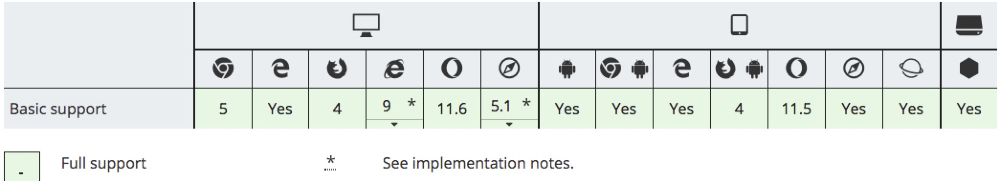

# Object.defineProperty

> vue.js 双向绑定的秘密


## 语法

```js
Object.defineProperty(obj, prop, descriptor)
```

## 参数

`obj`: 要在其上定义属性的对象

`prop`: 要定义或修改的属性的名称

`descriptor`: 将被定义或修改的属性描述符

### descriptor 属性描述符

对象里目前存在的属性描述符有两种主要形式：`数据描述符`和`存取描述符`。`数据描述符`是一个具有值的属性，该值可能是可写的，也可能不是可写的。`存取描述符`是由getter-setter函数对描述的属性。描述符必须是这两种形式之一；不能同时是两者。

数据描述符和存取描述符均具有以下可选键值:

`configurable`

当且仅当该属性的 `configurable` 为 true 时，该属性描述符才能够被改变，同时该属性也能从对应的对象上被删除。默认为 false。

```js
var a= {}

Object.defineProperty(a, "b", {
  configurable: false,
});

Object.defineProperty(a, "b", {
  configurable: true,
});

// Uncaught TypeError: Cannot redefine property: b
```

`enumerable`

当且仅当该属性的`enumerable`为true时，该属性才能够出现在对象的枚举属性中。默认为 false。

```js
var a= {};

Object.defineProperty(a, "a", {
  value: 1,
  enumerable: true,
});

Object.defineProperty(a, "b", {
  value: 2,
  enumerable: false,
});

Object.defineProperty(a, "c", {
  value: 3,
  enumerable: true,
});

console.log(Object.keys(a)); // ["a", "c"]  b不可被枚举
```

数据描述符同时具有以下可选键值：

`writable`

当且仅当该属性的`writable`为true时，value才能被赋值运算符改变。默认为 false。

```js
var a = {}; 

Object.defineProperty(a, "b", { 
  value: 1,
  writable: false,
});

console.log(a.b); // 1

a.b = 2;

console.log(a.b); // 1 没有改变, 只读

// 严格模式下
(function() {
  'use strict';
  var o = {};
  Object.defineProperty(o, 'b', {
    value: 1,
    writable: false,
  });
  o.b = 2; // Uncaught TypeError: Cannot assign to read only property 'b' of object '#<Object>'
  return o.b;
}());
```

`value`

该属性对应的值。可以是任何有效的 JavaScript 值（数值，对象，函数等）。默认为 `undefined`。

```js
var a = {};
Object.defineProperty(a, "b", {
  value: 1,
});

console.log(a.b) // 1
```

存取描述符同时具有以下可选键值：

`get`

一个给属性提供 getter 的方法，如果没有 getter 则为 `undefined`。当访问该属性时，该方法会被执行，方法执行时没有参数传入，但是会传入`this`对象（由于继承关系，这里的`this`并不一定是定义该属性的对象）。

默认值为`undefined`

`set`

一个给属性提供 setter 的方法，如果没有 setter 则为 `undefined`。当属性值修改时，触发执行该方法。该方法将接受唯一参数，即该属性新的参数值。

默认值为`undefined`


```js
var a = {};

Object.defineProperty(a, 'b', {
  set: function(newValue) {
    console.log('新的值是' + newValue);
    },
  get: function() {
    console.log('获取b的值');
    return 2;
   }
});

a.b = 1; // 给a.b赋值，触发set

var c = a.b; // 使用a.b 触发get
console.log(c); //  打印出 2

```

### 浏览器兼容

