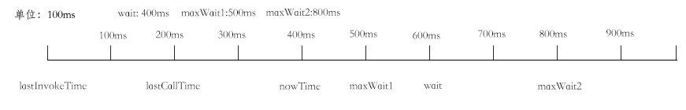

# js函数节流防抖以及lodash节流防抖的实现

## 函数防抖

先说下函数的防抖`debounce`。假如有这样一个需求，用户可以在输入框输入关键字时能够实时地去联想或者搜索内容。这实现起来比较简单，只要监听输入框的`keyup`或`input`事件，获取输入框的内容，做出对应的操作，调用处理函数就行了。但是这样有一个弊端，用户在持续输入关键字的同时事件处理函数也在无限制地被调用，调用的频率没有被限制，浏览器的负担也被加重。残缺的关键字更是没有搜索价值，影响了用户体验。

函数的防抖就是在持续调用函数时，保证在一段时间内函数不会被触发。如果在这段时间内，函数再次被调用，那么会更新时间并延时触发函数。

```js
function debounce(func, time) {
  let timer;
  return function() {
    if(timer) {
      clearTimeout(timer);
    }
    const args = arguments;
    timer = setTimeout(() => {
      func.apply(this, args);
    }, time);
  }
}
document.getElementById('input').addEventListener('input', debounce((e) => {
  console.log(e.target.value);
}, 500));
```

`debounce`的关键在于在定时器`timer`的更新，除非第一次调用，之后的每次调用都会清空和重置定时器。这样保证了持续调用都不会触发`func`,只有在`time`时间过后,`setTimeout`生效才会触发`func`。


## 函数节流

节流`throttle`与防抖相似，只是运用的场景不同。节流是指在持续调用时，保证一定时间内只触发一次事件处理函数。与防抖不同的是，函数节流会用在比`keyup`或`input`更加频繁触发的事件中，比如`scroll` `resize` 各类`mouse`事件。例如在实现悬浮导航，根据滚动距离来进行高亮处理，监听`scroll`事件也会无节制的触发事件处理函数。如果对滚动精度要求没那么高的话，可以使用节流要减少事件处理函数的触发频率。

```js
function throttle(func, time) {
  let start = Date.now();
  return function() {
    const now = Date.now();
    if (now - start >= time) {
      func.apply(this, arguments);
      start = Date.now();
    }
  }
}
window.addEventListener('scroll', throttle(function(){
  console.log(document.documentElement.scrollTop || document.body.scrollTop);
}, 500));
```

`throttle`关键在于对一个时间差的判断。每当调用时会获取当前时间，再于上次`func`触发时间做对比，如果时间差超过了`time`,那么会触发`func`，并重置`start`。

`throttle`的实现有多种，我们还可以添加定时器来实现最后一次触发事件还会执行一次事件处理函数。

```js
function throttle(func, time) {
  let start = Date.now();
  let timer;
  return function() {
    const now = Date.now();
    const args = arguments;
    if (timer) {
      clearTimeout(timer);
    }
    if (now - start >= time) {
      func.apply(this, arguments);
      start = Date.now();
    } else {
      timer = setTimeout(() => {
        func.apply(this, args)
      }, time);
    }
  }
}
```

非常明显的，这种`throttle`函数是与上面的`debounce`函数的结合，对时间差判断同时维护着`timer`,最后满足条件`setTimeout`生效触发一次`func`。

## lodash的节流防抖

```js
function debounce(func, wait, options) { // func 运行函数  wait 延时时间  options 配置项
  let lastArgs, // 参数
    lastThis, // 作用域
    maxWait, // 最大等待时间，在不满足条件下，func可能永远无法运行，最大等待时间保证在该时间内至少运行一次
    result, // func运行返回结果
    timerId, // 定时器id
    lastCallTime // 最后一次触发事件的时间

  let lastInvokeTime = 0 // 最后一次func执行时间
  let leading = false // 是否在每个等待延时的开始调用函数
  let maxing = false // 是否存在最大等待时间
  let trailing = true // 是否在每个等待延时的结束调用函数

  // Bypass `requestAnimationFrame` by explicitly setting `wait=0`.
  // root来自于lodash的.internal/root.js，根据global 和 self 来判断运行环境
  // 判断是否传了wait参数，若没有传或wait = 0且存在requestAnimationFrame，则会使用requestAnimationFrame
  const useRAF = (!wait && wait !== 0 && typeof root.requestAnimationFrame === 'function')

  if (typeof func != 'function') { // 函数类型验证
    throw new TypeError('Expected a function')
  }
  wait = +wait || 0 // wait数字类型转换
  if (isObject(options)) { // 判断配置项是否为对象，赋值
    leading = !!options.leading
    maxing = 'maxWait' in options
    maxWait = maxing ? Math.max(+options.maxWait || 0, wait) : maxWait
    trailing = 'trailing' in options ? !!options.trailing : trailing
  }

  function startTimer(pendingFunc, wait) { // 开启定时器
    if (useRAF) { // 如果需要调用 requestAnimationFrame
      return root.requestAnimationFrame(pendingFunc)
    }
    return setTimeout(pendingFunc, wait)
  }

  function cancelTimer(id) { // 清除定时器
    if (useRAF) {
      return root.cancelAnimationFrame(id)
    }
    clearTimeout(id)
  }

  // ...
}
```

lodash的`debounce`函数多了一个`options`配置项,里面有3个属性。`leading`代表是否在每个等待延时的开始调用函数,功能是在防抖前能否立即执行一次`func`,`trailing`代表是否在每个等待延时的结束调用函数，功能是在防抖后在执行一次`func`,`maxWait`代表是否存在最大等待时间，保证在在一段时间内执行一次`func`。

### debounced

```js
function debounced(...args) {
  const time = Date.now()
  const isInvoking = shouldInvoke(time)

  lastArgs = args
  lastThis = this
  lastCallTime = time

  if (isInvoking) {
    if (timerId === undefined) {
      return leadingEdge(lastCallTime)
    }
    if (maxing) { // 如果有设置最大等待时间，则重启定时器，立即执行func
      // Handle invocations in a tight loop.
      timerId = startTimer(timerExpired, wait)
      return invokeFunc(lastCallTime)
    }
  }
  if (timerId === undefined) {
    timerId = startTimer(timerExpired, wait)
  }
  return result
}
```

返回的`debounced`函数会先用`shouldInvoke`方法做一次时间的验证，传入当前时间

```js
function shouldInvoke(time) {
    const timeSinceLastCall = time - lastCallTime // 距离上次debounced调用所经过的时间
    const timeSinceLastInvoke = time - lastInvokeTime // 距离上次func调用所经过的时间
    return (lastCallTime === undefined || (timeSinceLastCall >= wait) ||
      (timeSinceLastCall < 0) || (maxing && timeSinceLastInvoke >= maxWait))
  }
```

逻辑比较简单，只需满足一下4个条件之一就可以返回`true`

1. 第一次执行
2. 距离上次debounced调用所经过的时间已经超过wait时间
3. 距离上次debounced调用所经过的时间小于0，系统时间倒退或调整
4. 设置了最大等待时间且距离上次func调用所经过的时间超过最大等待时间

如果`shouldInvoke`为`true`,且`timerId`定时器没有设置(一般这时为第一次执行debounced或者防抖延时后执行debounced)则调用`leadingEdge`

```js
function leadingEdge(time) {
  // Reset any `maxWait` timer.
  lastInvokeTime = time
  // Start the timer for the trailing edge.
  timerId = startTimer(timerExpired, wait)
  // Invoke the leading edge.
  return leading ? invokeFunc(time) : result
}
```

在`leadingEdge`中，设置`lastInvokeTime`(距离上一次func函数调用时间),开始`timerId`定时器，判断`leading`为`true`的话会调用`invokeFunc`(立即执行func函数)，实现了上文提到的防抖前能立即执行一次`func`功能。


下面来看看定时器中`timerExpired`做了什么

```js
function timerExpired() {
  const time = Date.now()
  if (shouldInvoke(time)) {
    return trailingEdge(time)
  }
  // Restart the timer.
  timerId = startTimer(timerExpired, remainingWait(time))
}
```

定时器`timerId`生效的时候,判断当前时间是否满足条件，如果不满足则重启新的定时器，利用`remainingWait`计算新定时器的延时时间。

```js
function remainingWait(time) {
  const timeSinceLastCall = time - lastCallTime // 距离上次debounced调用所经过的时间
  const timeSinceLastInvoke = time - lastInvokeTime // 距离上次func调用所经过的时间
  const timeWaiting = wait - timeSinceLastCall // 还需等待时间

  return maxing
    ? Math.min(timeWaiting, maxWait - timeSinceLastInvoke)
    : timeWaitingz
}
```

如果没有设置最大等待时间，则使用剩余等待时间。设置了最大等待时间，则对比剩余等待时间和剩余最大等待时间，取小值。

判断了后面经过的时间会先满足`wait`时间条件还是`maxWait`时间条件。

来自灵魂画师的图解



这里我设置了`maxWait1 500ms` 和 `maxWait2 800ms`两种情况。当前时间400ms,maxWait1情况下，下一次执行定时器应该在500ms,先满足`maxWait`最大等待时间中必须运行一次func。在maxWait2情况下，下一次执行定时器应该在600ms,先满足`wait`延时时间后运行func。所以这里使用了`Math.min`取2种时间的小值。


在`timerExpired`中若满足时间条件则会执行`trailingEdge`

```js
function trailingEdge(time) {
  timerId = undefined

  // Only invoke if we have `lastArgs` which means `func` has been
  // debounced at least once.
  if (trailing && lastArgs) {
    return invokeFunc(time)
  }
  lastArgs = lastThis = undefined
  return result
}
```
`trailingEdge`相当于防抖延时结束后执行的函数，清空了`timerId`,如若有`trailing` 和 `lastArgs` 会立即执行`func`，实现了上文说的最后一次触发事件还会执行`func`的功能。

最后是`invokeFunc`函数, 重置`lastArgs`、`lastThis`，设置最新的`func`执行时间。比较简单一目了然。

```js
function invokeFunc(time) {
    const args = lastArgs
    const thisArg = lastThis
    //  重置
    lastArgs = lastThis = undefined;
    lastInvokeTime = time; // 设置最新的时间
    result = func.apply(thisArg, args);
    return result;
  }
```
