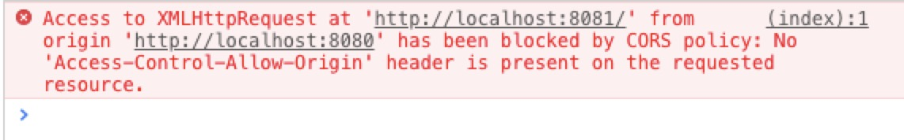
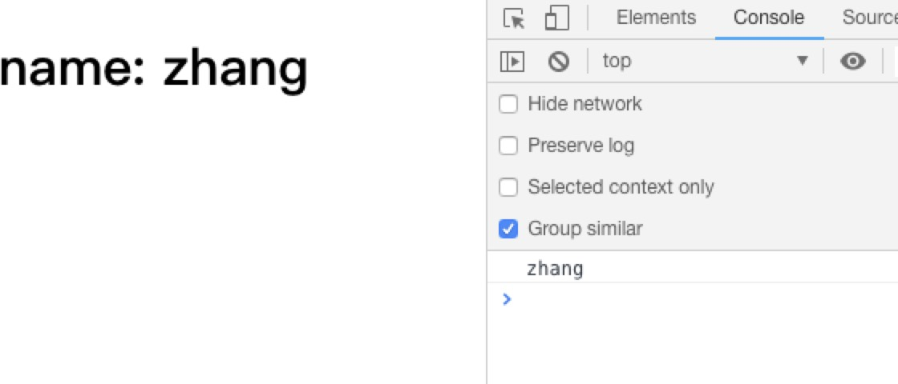
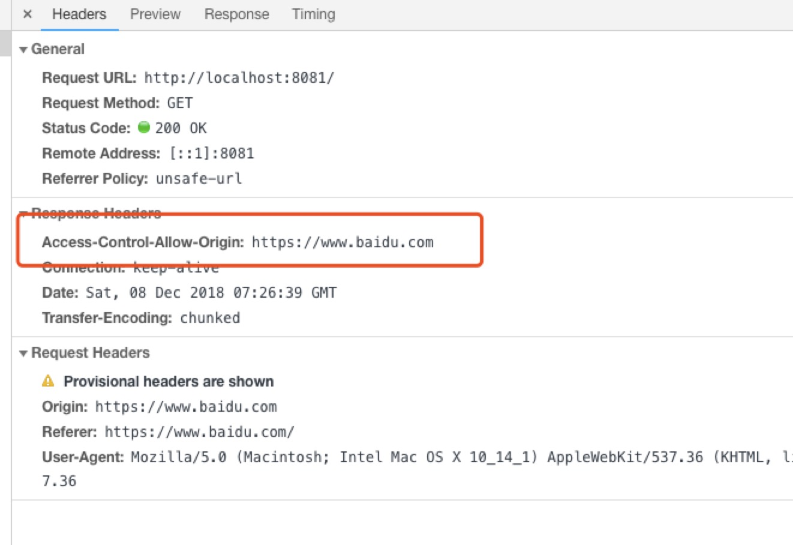
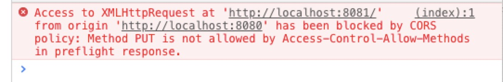
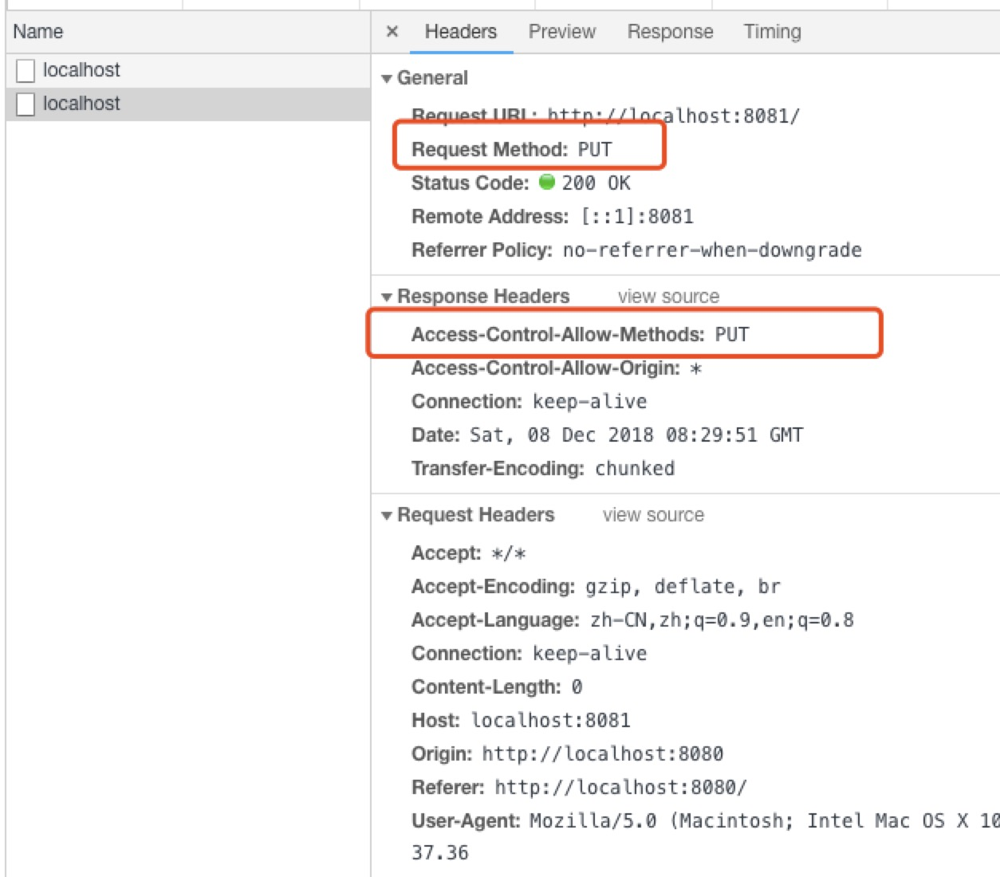
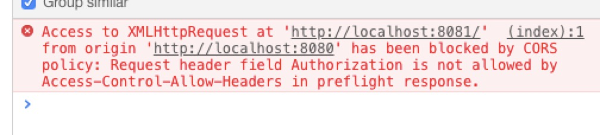
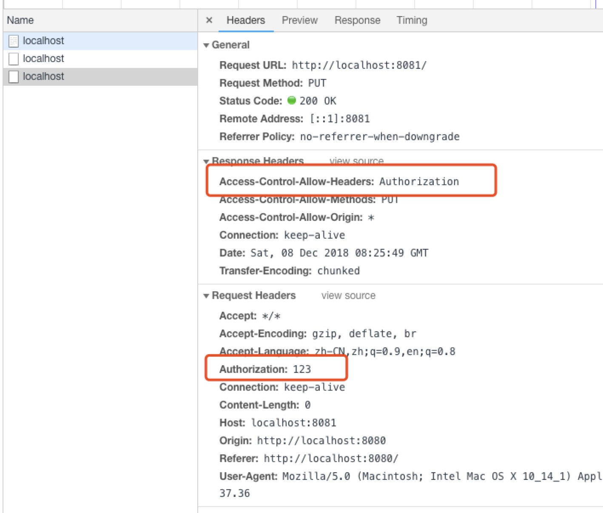
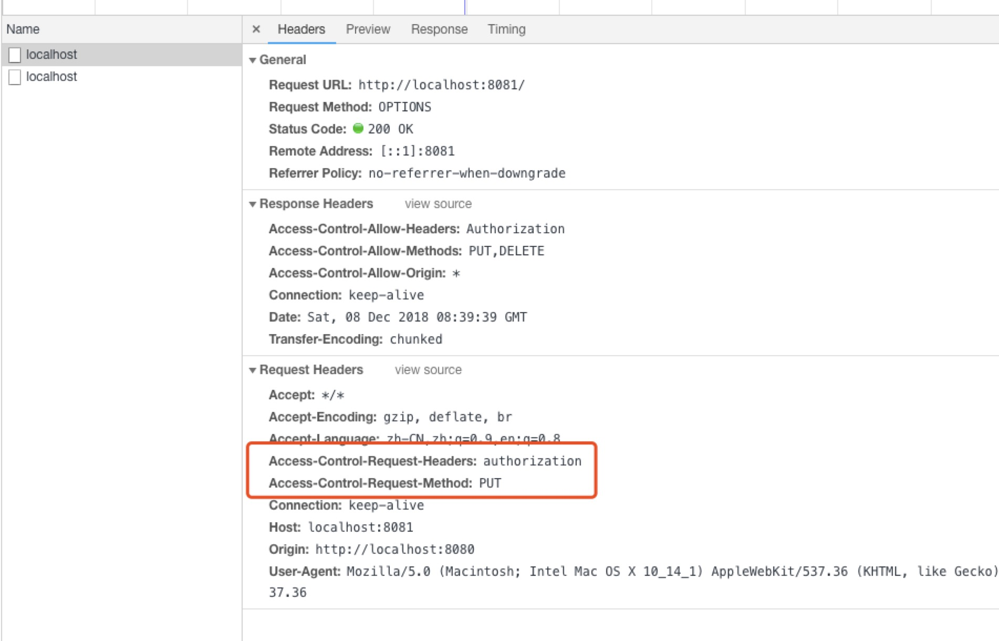
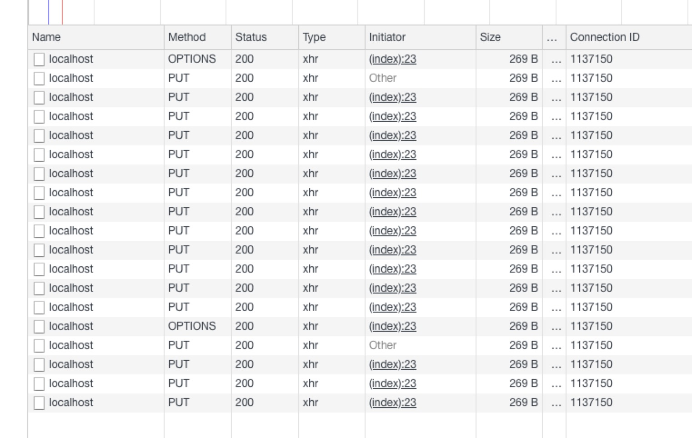

# 跨域CORS的实现以及koa-cors的原理

## 搭建一个简单的跨域环境

后端`server.js`

```js
const http = require('http');
const fs = require('fs');

const server = http.createServer((req, res) => {
  const html = fs.readFileSync('./index.html', 'utf8');
  res.end(html);
}).listen(8080);
```

开启一个node服务，监听8080端口，访问读取`index.html`

后端`api.js`, 监听8081端口

```js
const http = require('http');

const server = http.createServer((req, res) => {

  res.end('zhang');
  
}).listen(8081);
```

前端 `index.html`

```html
<!DOCTYPE html>
<html lang="en">
<head>
  <meta charset="UTF-8">
  <meta name="viewport" content="width=device-width, initial-scale=1.0">
  <meta http-equiv="X-UA-Compatible" content="ie=edge">
  <title>Document</title>
</head>
<body>
  <h1>name: <span id="name"></span></h1>
  <script>
    const xhr = new XMLHttpRequest()
    xhr.open('GET', 'http://localhost:8081')
    xhr.onreadystatechange = function() {
      if(xhr.readyState === 4 && xhr.status === 200) {
        console.log(xhr.responseText)
        document.getElementById('name').innerHTML = xhr.responseText;
      }
    }
    xhr.send();
  </script>
</body>
</html>
```

前端向`http://localhost:8081`发起请求，由于端口不同造成了跨域。




## Access-Control-Allow-Origin

上图的报错已经很明显了，提示缺少了`Access-Control-Allow-Origin`的跨域头

从浏览器的Network中，我们可以发现，其实请求是成功的，服务器也顺利返回了内容。但是由于浏览器的同源策略，浏览器发现没有`Access-Control-Allow-Origin`的头并且设置允许的话，会将请求过来的内容忽略掉，并提示错误。这是浏览器提供的功能，如果你从curl 或者 服务端发起请求，就完全没有限制。

于是我们给响应头添加`Access-Control-Allow-Origin`

```js
const http = require('http');

const server = http.createServer((req, res) => {

  res.writeHead(200, {
    'Access-Control-Allow-Origin': '*',
  });

  res.end('zhang');
  
}).listen(8081);
```

`*`是通配符，代表所有的请求都能被允许。于是就成功获取到了内容。



当然所有的服务都能接受这并不安全，我们可以设置为某个特定的域名。

```js
res.writeHead(200, {
    'Access-Control-Allow-Origin': 'http://localhost:8081',
  });
```

`Access-Control-Allow-Origin`只能设置一个域名，如果要实现多个业务域名跨域，我们可以获取`req.headers.origin`，判断是否是允许的，动态添加到`Access-Control-Allow-Origin`头上。

```js
const http = require('http');

const server = http.createServer((req, res) => {

  const origins = ['http://localhost:8080', 'https://www.baidu.com'];
  const origin = req.headers.origin;

  if (origins.includes(origin)) {
    res.writeHead(200, {
      'Access-Control-Allow-Origin': origin,
    });
  }
  

  res.end('zhang');
  
}).listen(8081);
```

所以我们可以在百度页面的控制台中成功发起请求接收数据。



## Access-Control-Allow-Methods

在CORS中还存在着其他的限制，比如Method。

我们改成`PUT`请求：

```html
<script>
    const xhr = new XMLHttpRequest()
    xhr.open('PUT', 'http://localhost:8081')
    xhr.onreadystatechange = function() {
      if(xhr.readyState === 4 && xhr.status === 200) {
        console.log(xhr.responseText)
        document.getElementById('name').innerHTML = xhr.responseText;
      }
    }
    xhr.send();
  </script>
```



再次顺便介绍下在CORS机制中的 `简单请求` 和 `非简单请求`。

`简单请求`满足以下特征：

1. 请求方法只能是`HEAD` `GET` `POST`之一
2. 请求头只能包含 `Accept` `Accept-Language` `Content-Language` `Content-Type` `DPR` `Downlink` `Save-Data` `Viewport-Width` `Width`
3. `Content-Type` 只允许 `text/plain` `multipart/form-data` `application/x-www-form-urlencoded`

不满足这些特征的被称为`非简单请求`。进行非简单请求时候，浏览器会首先发出类型为OPTIONS的`预检请求`做验证。

所以我们发送的`PUT`请求需要设置`Access-Control-Allow-Methods`才能被允许

```js
res.writeHead(200, {
  'Access-Control-Allow-Origin': '*',
  'Access-Control-Allow-Methods': 'PUT',
});
```



## Access-Control-Allow-Headers

在业务中，我们的请求可能会带上token

```js

xhr.setRequestHeader('Authorization', '123')

```

服务端会接收`Authorization`自定义头做身份验证。但是在CORS限制中并不支持自定义头，所以结果可想而知



同样的，可以在响应头设置`Access-Control-Allow-Headers`,问题就迎刃而解了。

```js
res.writeHead(200, {
  'Access-Control-Allow-Origin': '*',
  'Access-Control-Allow-Methods': 'PUT',
  'Access-Control-Allow-Headers': 'Authorization',
});
```



## 预检请求

浏览器在发起跨域请求时，会判断该请求是否是跨域请求。如果是且非简单请求，会增加一次HTTP的查询请求，称为"预检"请求。

预检请求的请求方法是`OPTIONS`, 头信息包含2个特殊的字段。

* Access-Control-Request-Method

  用来列出浏览器的CORS请求会用到哪些HTTP方法，例子中是PUT

* Access-Control-Request-Headers

  该字段是一个逗号分隔的字符串，指定浏览器CORS请求会额外发送的头信息字段, 例子中是Authorization



服务端接收到预检请求后，检查`Access-Control-Request-Method` `Access-Control-Request-Headers`后，允许进行跨域请求，浏览器才会继续发送真正的 AJAX 请求。

非简单请求都会发起预检请求，我们可以通过`Access-Control-Max-Age`设置预检请求的有效期（秒），类似缓存机制。在有效期内，再次发起非简单请求就不需要预检请求。

```js
res.writeHead(200, {
  'Access-Control-Allow-Origin': '*',
  'Access-Control-Allow-Methods': 'PUT',
  'Access-Control-Allow-Headers': 'Authorization',
  'Access-Control-Max-Age': 4,
});
```



图中可以看到，设置了4秒有效期，在有效期内连续发送请求都不会有预检请求。