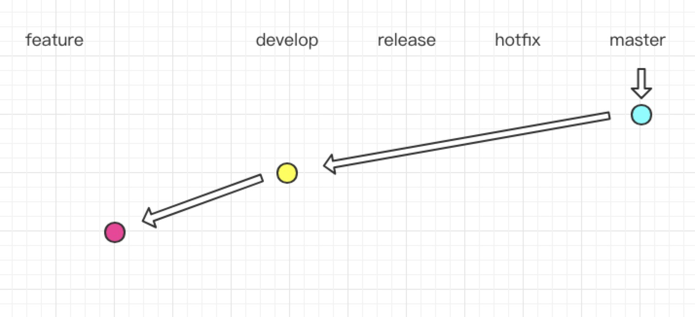
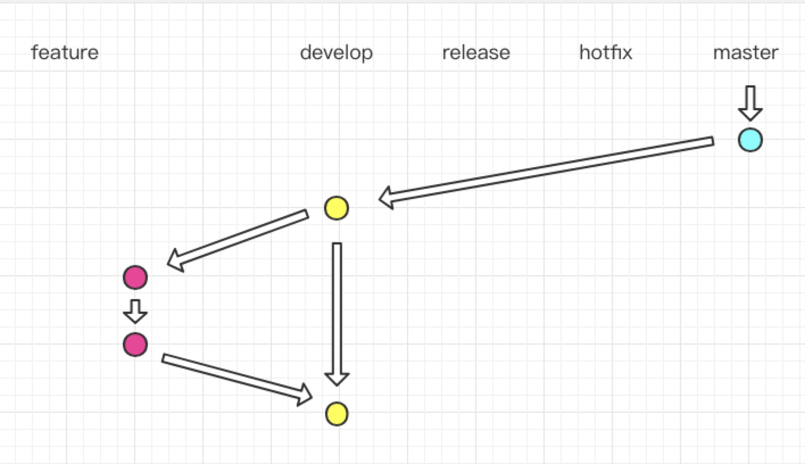
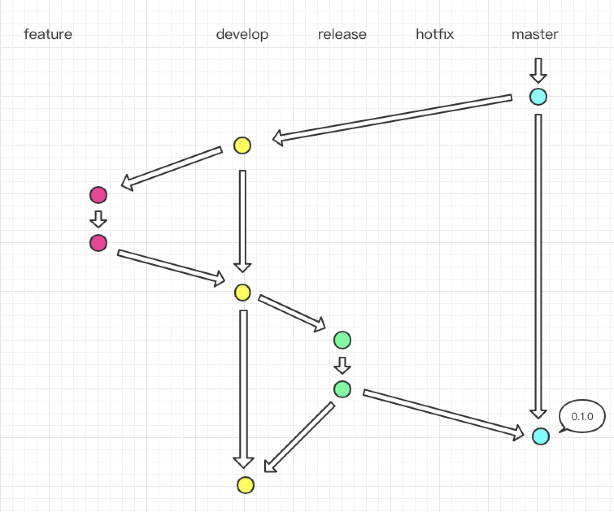
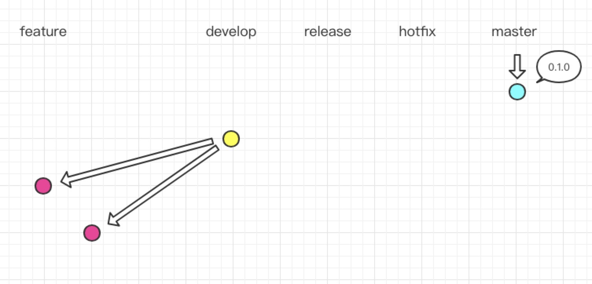
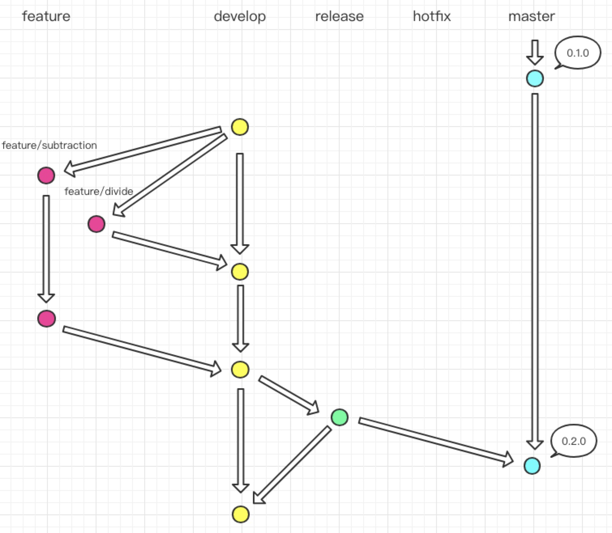
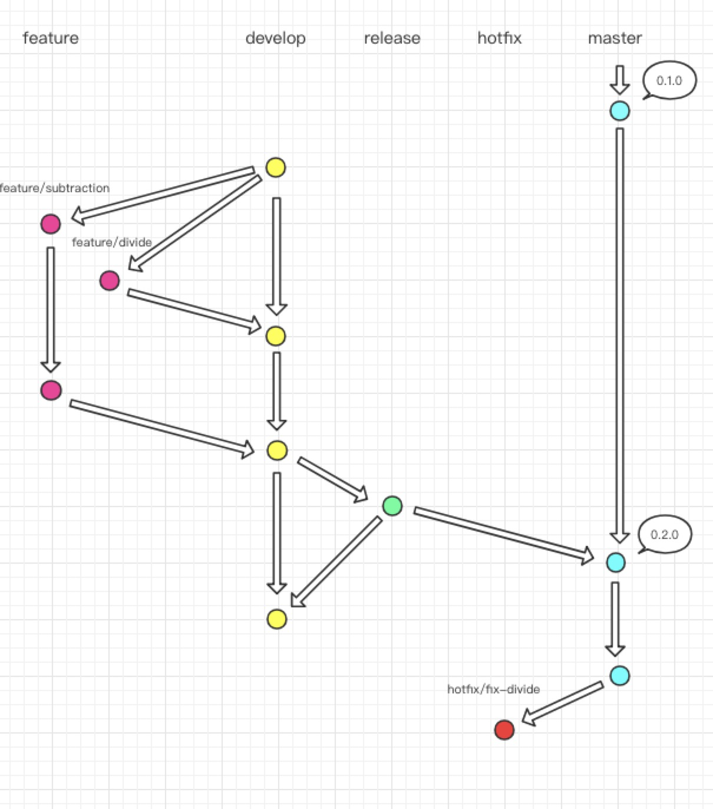
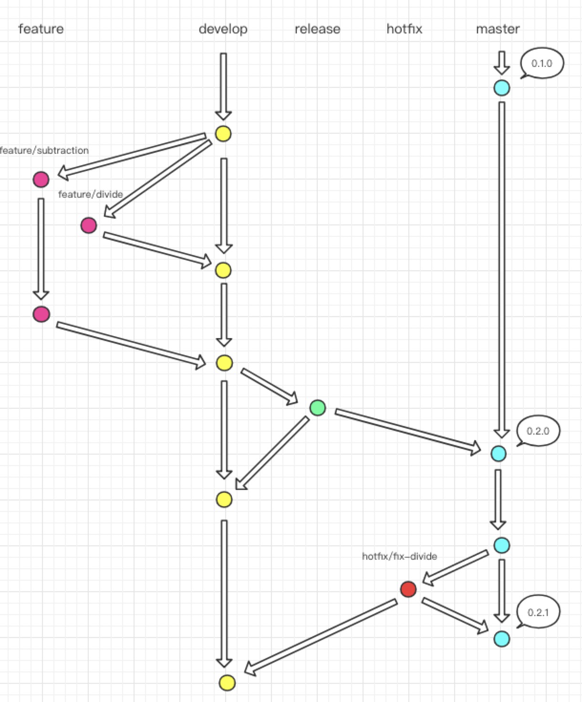

# git-flow分支

**分支模型**

`master`

* master 为主分支，也是用于部署生产环境的分支，确保master分支稳定性
* master 分支一般由develop以及hotfix分支合并，任何时间都不能直接修改代码

`develop`

* develop 为开发分支，始终保持最新完成以及bug修复后的代码
* 一般开发的新功能时，feature分支都是基于develop分支下创建的

`feature`

* 开发新功能时，以develop为基础创建feature分支
* 分支命名: feature/ 开头的为特性分支

`release`

* release 为预上线分支，发布提测阶段，会release分支代码为基准提测

`hotfix`

* 分支命名: hotfix/ 开头的为修复分支，它的命名规则与 feature 分支类似
* 线上出现紧急问题时，需要及时修复，以master分支为基线，创建hotfix分支，修复完成后，需要合并到master分支和develop分支

**例子**

假设我们有个新项目，是一个计算器功能，计算器能计算两数之合。

首先初始化代码，创建`calculator.js`，在正常工作中多数会配置cli等，提交`master`。

然后在`master`上创建`develop`分支开发项目。如果有多个同事同时开发多个功能，每人需要从`develop`分支上创建`feature`分支，代表各自所新增的功能。每个`feature`颗粒要尽量小，因为它需要我们能尽早merge回`develop`分支，否则会有多种冲突。

这里我创建`feature/add`的功能分支来编写计算器加法业务逻辑。

```js
// calculator.js

function add(a, b) {
  return a + b;
}
```



完成计算器加法功能后，将`feature/add`分支整合到`develop`分支中去，`feature/add`也完成了自己的使命，清理掉已完成的功能分支，将分支切换到`develop`



接下来进入测试阶段，在`develop`分支下创建`release`分支，命名为`0.1.0`，一般用版本号命名。测试人员将会在`release`分支上测试，同时开发人员也会在该分支上修改bug

```js
// calculator.js

function add(a, b) {
  // ...修改的bug
  return a + b;
}
```

修改完bug以后，发布上线，同时将`release`分支整合到`master` 和 `develop` 分支上。



接着我们的计算器要进行迭代了，新增减法跟除法功能，并且由于功能“繁重”，邀请了同学A和同学B共同开发。

同学A写减法功能，`develop` 分支上创建了`feature/subtraction`分支

```js
// calculator.js

function add(a, b) {
  // ...修改的bug
  return a + b;
}

function subtraction(a, b) {
  return a - b;
}
```

同学B写除法功能，`develop` 分支上创建了`feature/divide`分支

```js
// calculator.js

function add(a, b) {
  // ...修改的bug
  return a + b;
}

function divide(a, b) {
  return a / b;
}
```



开发完成后分别整合到`develop`分支，解决冲突

```js
// calculator.js

function add(a, b) {
  // ...修改的bug
  return a + b;
}

function subtraction(a, b) {
  return a - b;
}

function divide(a, b) {
  return a / b;
}
```

接着进入测试阶段，同上一个版本流程一样，`develop`分支上创建`release`分支，命名为`0.2.0`,通过测试后，整合到`master` 和 `develop` 分支上。



如果上线突然发现bug，需要紧急处理，则可以在`master` 创建`hotfix`分支来修复bug。与`release`分支不同的是，`hotfix` 分支是基于 `master` 检出的。

这里创建`hotfix/fix-divide`分支



修改完bug，再将`hotfix`分支整合到`master` 和 `develop` 分支上。

