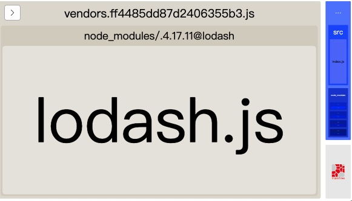
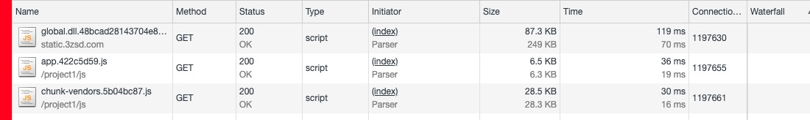
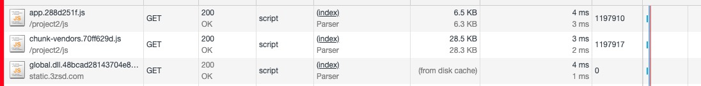

# 利用DllPlugin来优化webpack打包速度以及多个项目公用依赖包缓存优化

## DllPlugin和DllReferencePlugin

DllPlugin和DllReferencePlugin提供分离包的方式可以大大提高构建时间性能。主要思想在于，将一些不做修改的依赖文件，提前打包，这样我们开发代码发布的时候就不需要再对这部分代码进行打包。从而节省了打包时间。

第一步先将不做修改的依赖文件如`vue` `react` `jquery`等库单独打包出来。新建`webpack.dll.js`

```js
const path = require('path');
const webpack = require('webpack');

module.exports = {
	mode: 'production',
	entry: {
		global: ['vue', 'react', 'jquery'],
	},
	output: {
		filename: '[name].dll.[hash].js',
		path: path.resolve(__dirname, './dll'),
		library: '[name]_library'
	},
	plugins: [
		new webpack.DllPlugin({
			name: '[name]_library',
			path: path.resolve(__dirname, './dll/[name].manifest.json'),
		})
	]
}
```

添加脚本并运行，之后会在当前目录下生成dll文件夹，包含js文件和对应依赖映射的json，这个文件会告诉webpack哪些文件已经打包好了。

```json
{
  "scripts": {
    "build:dll": "webpack --config webpack.dll.js"
  },
}
```

在`webpack.config.js`配置文件中添加webpack自带的`DllReferencePlugin`插件

```js
module.exports = {
	plugins: [
		new webpack.DllReferencePlugin({
			manifest: path.resolve(__dirname, './dll/global.manifest.json') // 映射文件路径
		})
	]
}
```

下载`AddAssetHtmlWebpackPlugin`（webapck3需要2.x版本），利用该插件将刚刚打包好的全局依赖文件`global.dll.[hash].js`置入打包好的html文件中。

```
npm i add-asset-html-webpack-plugin -D
```

```js
module.exports = {
	plugins: [
    new AddAssetHtmlWebpackPlugin({
      filepath: path.resolve(__dirname, './dll/global.dll.0d4708ecba99397d3606.js'),
    }),
		new webpack.DllReferencePlugin({
			manifest: path.resolve(__dirname, './dll/global.manifest.json') // 映射文件路径
		})
	]
}
```

修改`index.js`来进行打包速度测试

```js
import Vue from 'vue';
import React from 'react';
import _ from 'lodash';
import $ from 'jquery';

console.log(Vue);
console.log(React);
console.log(_);
console.log($);
```

多次打包测试后，在未加入DllPlugin打包用时约为1.1s

```
Hash: d5dd0880c35b7960b714
Version: webpack 4.31.0
Time: 1102ms
Built at: 2019-06-17 15:47:50
                          Asset       Size   Chunks             Chunk Names
                     index.html  480 bytes           [emitted]  
   main.d5dd0880c35b7960b714.js   32.6 KiB     main  [emitted]  main
vendors.d5dd0880c35b7960b714.js   1.15 MiB  vendors  [emitted]  vendors
```

加入DllPlugin打包用时约为0.85s

```
Hash: ff4485dd87d2406355b3
Version: webpack 4.31.0
Time: 851ms
Built at: 2019-06-17 15:49:49
                             Asset       Size   Chunks             Chunk Names
global.dll.c2a0807582e4470811bc.js    163 KiB           [emitted]  
                        index.html  561 bytes           [emitted]  
      main.ff4485dd87d2406355b3.js   35.7 KiB     main  [emitted]  main
   vendors.ff4485dd87d2406355b3.js    546 KiB  vendors  [emitted]  vendors
```

同时加入`webpack-bundle-analyzer`进行依赖分析，`vendors`文件只留下`lodash`，说明打包是成功的。



## 公用依赖包缓存优化

利用vue-cli3 创建`project1` 和 `project2`文件作为测试。 下载 `webpack` `webpack-cli` `jquery` `lodash`依赖，修改`main.js`文件加入依赖

```js
import Vue from 'vue';
import App from './App.vue';
import router from './router';
import store from './store';
import $ from 'jquery';
import _ from 'lodash';

Vue.config.productionTip = false;

new Vue({
  router,
  store,
  render: h => h(App),
}).$mount('#app');

$('body').css('background', 'red'); // 判断jquery是否引用
```


运行`npm run serve`，首页背景变红。

接下来将`vue` `vue-router` `jquery` `lodash`提取出来，新建`webpack.dll.js`，配置内容如上文。运行生成dll文件夹。

添加`vue.config.js`配置文件，添加`DllReferencePlugin` 和 `AddAssetHtmlWebpackPlugin` 插件，打包生成dist文件夹。

```js
const webpack = require('webpack');
const path = require('path');
const AddAssetHtmlWebpackPlugin = require('add-asset-html-webpack-plugin');

module.exports = {
  publicPath: process.env.NODE_ENV === 'production'
    ? '/project1'
    : '/',
  configureWebpack: config => {
    if (process.env.NODE_ENV === 'production') {
      // 为生产环境修改配置...
      return {
        plugins: [
          new webpack.DllReferencePlugin({
            manifest: path.resolve(__dirname, './dll/global.manifest.json')
          }),
          new AddAssetHtmlWebpackPlugin({
            filepath: path.resolve(__dirname, './dll/global.dll.48bcad28143704e842c1.js'),
            publicPath: 'http://static.3zsd.com'
          }),
        ]
      }
    } else {
      // 为开发环境修改配置...
    }
  }
}
```

将project1项目中的dll文件夹复制给project2项目，配置project2项目的`vue.config.js`，打包生成dist文件

```js
const webpack = require('webpack');
const path = require('path');
const AddAssetHtmlWebpackPlugin = require('add-asset-html-webpack-plugin');

module.exports = {
  publicPath: process.env.NODE_ENV === 'production'
    ? '/project2'
    : '/',
  configureWebpack: config => {
    if (process.env.NODE_ENV === 'production') {
      // 为生产环境修改配置...
      return {
        plugins: [
          new webpack.DllReferencePlugin({
            manifest: path.resolve(__dirname, './dll/global.manifest.json')
          }),
          new AddAssetHtmlWebpackPlugin({
            filepath: path.resolve(__dirname, './dll/global.dll.48bcad28143704e842c1.js'),
            publicPath: 'http://static.3zsd.com'
          }),
        ]
      }
    } else {
      // 为开发环境修改配置...
    }
  }
}
```

启一个服务先后访问`localhost:9999/project1` 和 `localhost:9999/project2`

在project1中，打开控制台可以看到`global.dll.js`文件没有缓存



在project2中，`global.dll.js`文件已经from dist cache，说明缓存成功

